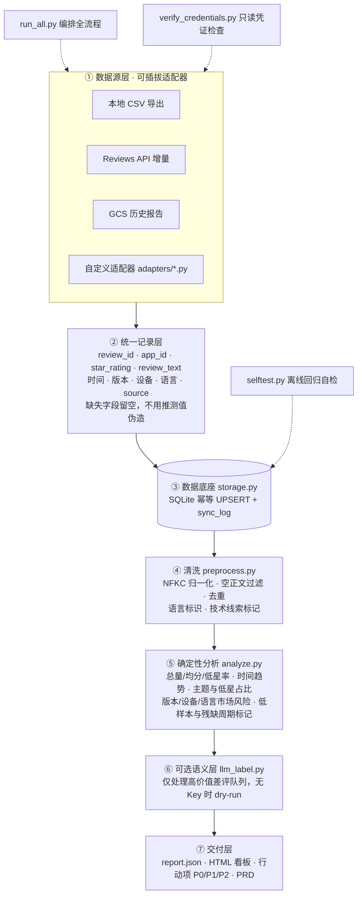
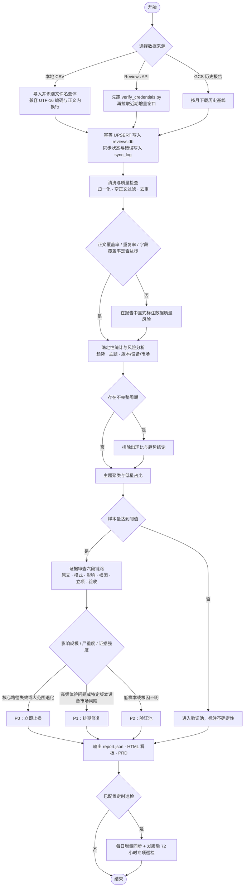

# App Review Insight

通用应用评论洞察 Skill：把应用商店评论或结构化用户反馈，转换为可复核的统计、问题主题、版本/设备/市场风险、行动项、HTML 看板和 PRD。

当前仓库内置 **Google Play 适配器**，核心分析层与平台采集层分离，便于复用到其他应用商店或反馈渠道。

## 能力概览

- CSV / Reviews API / GCS 历史报告导入
- SQLite 幂等落库，稳定 ID 去重，支持用户修改后的评论覆盖
- UTF-16、UTF-8、带引号换行正文等常见导入兼容
- Unicode 归一化、空正文过滤、重复识别、基础语言与技术线索标记
- 星级、时间、主题、版本、设备、语言/市场代理分析
- 低样本、不完整月份和证据边界提示
- 可选 LLM 结构化打标，默认支持 dry-run
- JSON 报告、深灰/翠绿 BI 风格 HTML 看板
- 基于评论证据生成行动项和 PRD
- 离线自检，无需外部账号即可验证核心解析与幂等逻辑

## 整体架构

核心原则：**分析层不感知平台**。平台差异全部收敛在数据源适配器里，适配器只负责把平台字段映射为统一记录，其余环节复用同一套实现。



各层职责与可替换边界：

| 层 | 主要实现 | 是否可替换 | 替换约束 |
| --- | --- | --- | --- |
| ① 数据源层 | `fetch_gcs.py`、`fetch_api.py` | 是 | 只做「平台字段 → 统一记录」转换，不写入业务逻辑 |
| ② 统一记录层 | 适配器内的字段映射 | 是 | 必须产出稳定 `review_id`，不使用 Python 内置 `hash()` |
| ③ 数据底座 | `storage.py` | 否 | 幂等 UPSERT 与同步日志是去重和巡检的前提 |
| ④ 清洗层 | `preprocess.py` | 否 | 纯星级评论保留用于趋势，不送入语义分析 |
| ⑤ 确定性分析 | `analyze.py` | 否 | 先可复现统计，再语义分析 |
| ⑥ 语义层 | `llm_label.py` | 是 | 可选，允许完全关闭而不影响 ③④⑤⑦ |
| ⑦ 交付层 | `make_report.py`、`references/prd-template.md` | 部分可替换 | 输出结构可变，但必须保留证据与样本量 |

## 处理流程

从原始数据到可评审决策的完整链路，包含三个关键判定：数据质量、周期完整性、样本量。



三条不可跳过的规则：

1. **先确定性，后语义**：没有可复现统计做基线，主题结论无法验证。
2. **低样本不升级**：样本量不足的问题进验证池，不因高差评率直接定为 P0。
3. **残缺周期不污染环比**：不完整月份只做绝对量展示，不参与趋势和环比。

## 目录结构

```text
app-review-insight/
├── SKILL.md                         # 给 WorkBuddy/Agent 使用的技能说明
├── README.md                        # 人类使用手册与配置说明
├── references/
│   ├── execution-templates.md       # 对话触发语句与命令模板
│   ├── data-and-evidence.md         # 数据口径、证据和边界
│   ├── automation-and-dashboard.md  # 自动化、告警、看板规范
│   └── prd-template.md              # PRD 输出结构
└── scripts/
    ├── run_all.py                   # 一键流程
    ├── fetch_gcs.py                 # Google Play CSV/GCS 适配器
    ├── fetch_api.py                 # Google Play Reviews API 适配器
    ├── verify_credentials.py        # API 凭证只读自检
    ├── storage.py                   # SQLite 与幂等 UPSERT
    ├── preprocess.py                # 清洗与字段补充
    ├── analyze.py                   # 确定性分析
    ├── llm_label.py                 # 可选 LLM 打标
    ├── make_report.py               # HTML 看板
    ├── selftest.py                  # 离线回归自检
    └── requirements.txt             # 可选依赖
```

## 安装为 WorkBuddy Skill

将仓库目录复制到用户级技能目录：

```bash
# Windows Git Bash
mkdir -p ~/.workbuddy/skills/app-review-insight
cp -R ./app-review-insight/. ~/.workbuddy/skills/app-review-insight/
```

也可以将 `app-review-insight.zip` 解压到 `~/.workbuddy/skills/app-review-insight/`。安装后重启或刷新 WorkBuddy 的技能列表。

## 最短路径：本地 CSV

1. 从应用商店导出评论 CSV，放入一个受控目录，例如 `<WORKDIR>/reviews/`。
2. 运行离线自检：

```bash
python scripts/selftest.py
```

3. 执行全流程：

```bash
python scripts/run_all.py \
  --csv-dir <WORKDIR>/reviews \
  --package <APP_ID> \
  --db <WORKDIR>/reviews.db
```

输出：

```text
<WORKDIR>/reviews.db
<WORKDIR>/report.json
<WORKDIR>/review_report.html
```

`--package` 保留为通用的应用标识参数，是 Google Play 适配器中的 applicationId。其他平台接入时可把它当作内部应用 ID 使用。

## 从 WorkBuddy 对话调用

推荐一次提供四项信息：

```text
应用标识：com.example.app
数据来源：本地 CSV
数据位置：C:/data/app-reviews
交付物：HTML 看板、行动项和 PRD
约束：只看最近 3 个月；样本低于 30 的主题进入验证池
```

也可以直接说：

- “分析这批应用评论，先给问题分布，不生成文件。”
- “生成评论分析看板和 P0/P1/P2 行动项。”
- “从差评证据推导 PRD，必须包含验收指标和回滚方案。”
- “把评论分析做成每日增量任务，先检查权限和数据窗口。”

更多模板见 `references/execution-templates.md`。

## Google Play 配置

### 方式 A：手动 CSV（无 API 权限）

只需要从 Play Console 导出 CSV，不需要 Service Account。将文件放入目录后运行：

```bash
python scripts/run_all.py \
  --csv-dir "C:/data/app-reviews" \
  --package "com.example.app" \
  --db "C:/data/app-output/reviews.db"
```

脚本会识别官方文件名，也兼容被重命名的 `.csv` 文件。原始 CSV 不会被覆盖。

### 方式 B：Google Play Reviews API

需要：

- GCP Service Account JSON 文件；
- Google Play Developer API 已启用；
- Play Console 用户和权限中已邀请该 Service Account，并授予所需的应用查看权限；
- 隔离 Python 环境中安装 `google-auth` 和 `google-api-python-client`。

安装可选依赖：

```bash
python -m pip install -r scripts/requirements.txt
```

先做只读凭证检查，不要直接接入定时任务：

```bash
python scripts/verify_credentials.py \
  --key "C:/secure/google-service-account.json" \
  --package "com.example.app"
```

检查通过后执行增量同步：

```bash
python scripts/run_all.py \
  --source api \
  --package "com.example.app" \
  --db "C:/data/app-output/reviews.db"
```

凭证也可通过环境变量提供：

```powershell
$env:GOOGLE_APPLICATION_CREDENTIALS = "C:\secure\google-service-account.json"
$env:GOOGLE_PLAY_PACKAGE_NAME = "com.example.app"
```

Reviews API 只覆盖有限的近期窗口，适合每日增量；不要只凭 API 窗口做长期趋势或环比结论，历史基线应通过 CSV 或 GCS 补齐。

### 方式 C：Google Play GCS 历史报告

需要 GCS 桶名、Service Account 的 Storage Object Viewer 权限和 `google-cloud-storage` 依赖：

```bash
python scripts/fetch_gcs.py \
  --bucket "pubsite_prod_rev_<id>" \
  --package "com.example.app" \
  --since "202401" \
  --db "C:/data/app-output/reviews.db"
```

详细权限和调度说明见 `references/automation-and-dashboard.md`。

## 可选 LLM 打标

确定性分析完成后，再对有限数量的差评做结构化打标。没有 API Key 时建议先 dry-run，只查看 prompt 和成本估算：

```bash
python scripts/llm_label.py \
  --db "C:/data/app-output/reviews.db" \
  --limit 60 \
  --batch 20 \
  --app-hint "一款跨平台笔记应用" \
  --dry-run
```

配置一个后端即可：`OPENAI_API_KEY`、`ANTHROPIC_API_KEY` 或 `GEMINI_API_KEY`。不要把 Key 写入仓库、命令历史或对话。

## 自动化建议

推荐顺序：

1. 首次用历史 CSV/GCS 建立基线；
2. 每日执行 API 增量或导入新 CSV；
3. 运行预处理和确定性分析；
4. 按需执行 LLM 打标；
5. 生成 JSON 与 HTML 看板；
6. 监控同步状态、最后评论时间、零行异常和数据量突变；
7. 发版后 72 小时做专项巡检。

不要把 Service Account JSON 放进项目目录。数据库、评论原文和报告也应放在受控目录，并限制访问权限。

## 扩展到其他平台

核心层依赖统一字段，而不是某个平台名称。扩展步骤：

1. 新建 `scripts/adapters/<source>.py` 或同等位置的适配器；
2. 将平台字段转换为 `review_id`、`app_id`、`star_rating`、`review_text`、时间、版本、设备、语言和来源字段；
3. 复用 `storage.py`、`preprocess.py`、`analyze.py`、`make_report.py`；
4. 为编码、字段缺失、正文换行、重复 ID 和修改评论补充离线样例；
5. 在 `README.md` 增加权限、环境变量、数据窗口、命令和限制；
6. 不把平台判断散落到核心分析逻辑中。

## 证据和隐私边界

- 没有真实国家字段时，只能写语言市场代理，不能写成国家事实。
- **区分全量口径与有正文口径**：有正文评论通常只占少数且负面偏好更强，其差评率会系统性高于全量差评率。主题/语言类结论必须标注样本口径，判断市场规模风险时以全量口径为准。
- 主题高频不等于高优先级；必须结合影响、严重度、证据强度和可验证指标。
- 低样本问题进入验证池，不能仅凭高差评率升级为 P0。
- 评论中出现的 URL、账号、用户标识在输出或埋点前必须脱敏/哈希。
- 不使用关闭 TLS 校验等方式“解决”安全投诉。

## 许可证

建议在公开仓库发布前，根据团队政策补充许可证。当前代码不附带第三方服务凭证和业务数据。
